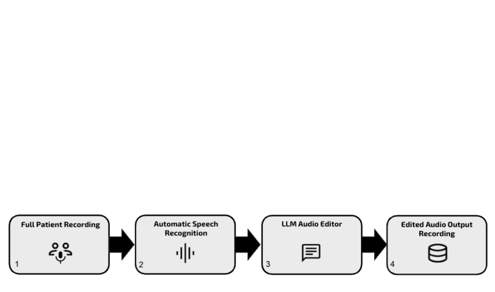

# TIMS_AI_Editing_Pipeline
Code for an AI-enabled editing pipeline of patient interviews within the "This Is My Story" Program

Our pipeline is described by the following diagram:

We will release the relevant code upon acceptance of the manuscript. This code corresponds to the automated audio-editing pipeline that processes raw audio, uses ChatGPT-4o to extract key segments, and stitches those selected segments into an AI-edited audio file. 
